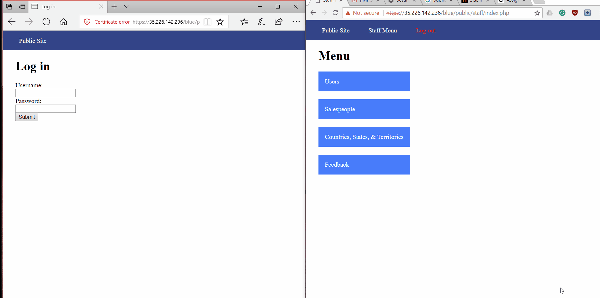
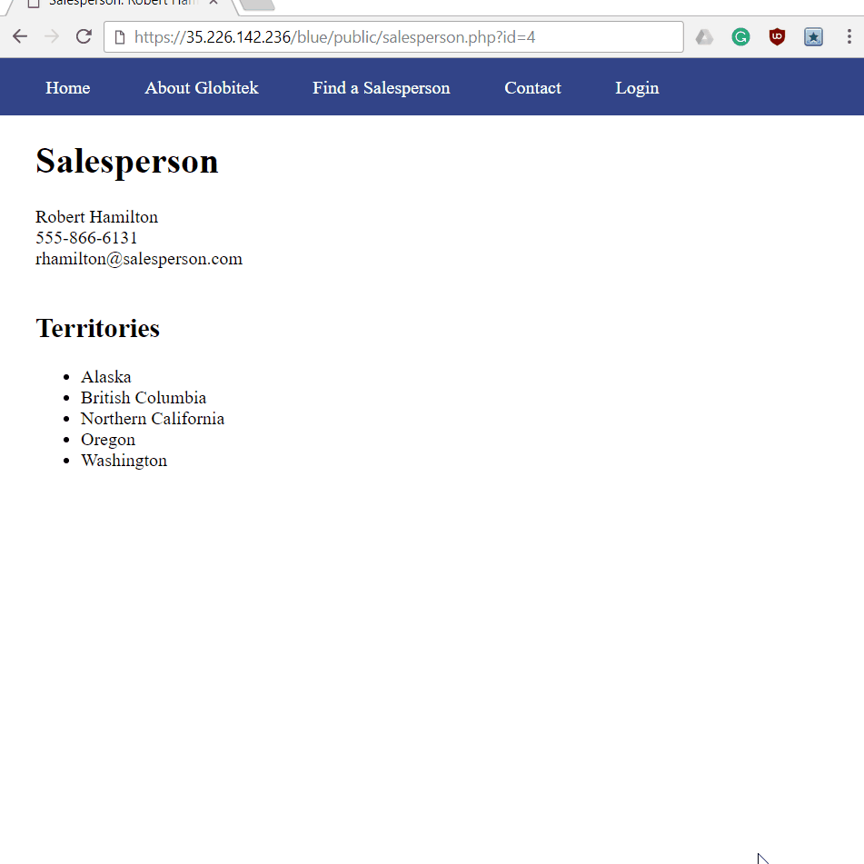
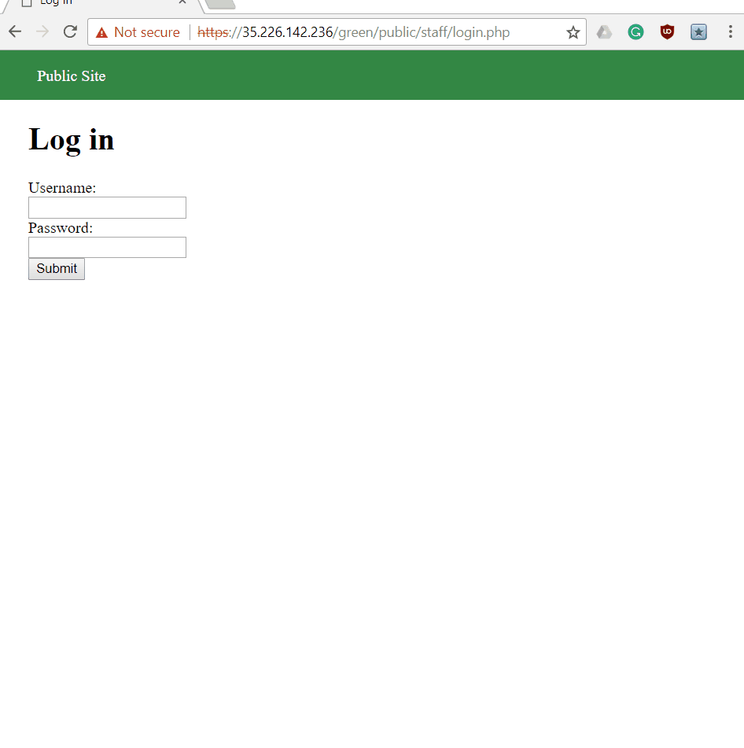
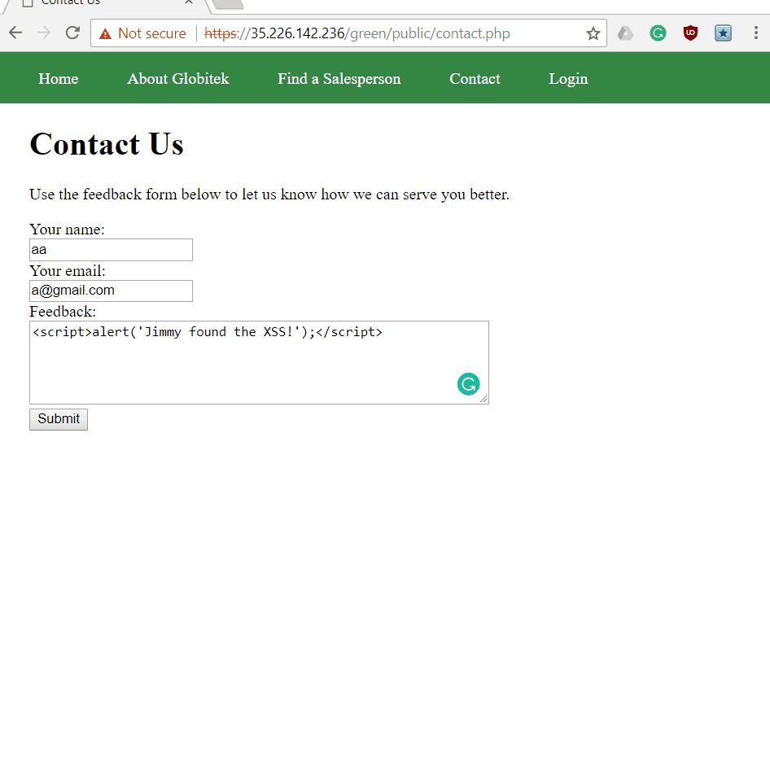
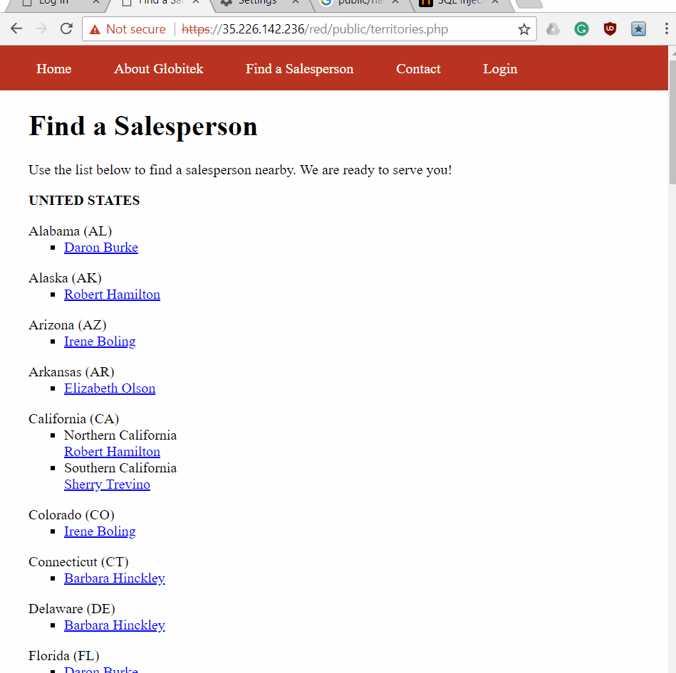
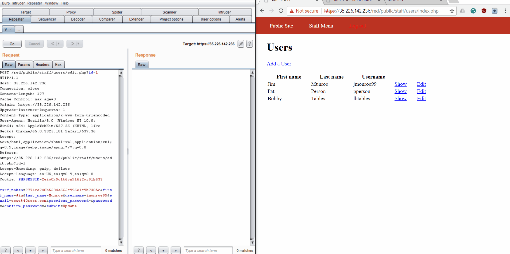
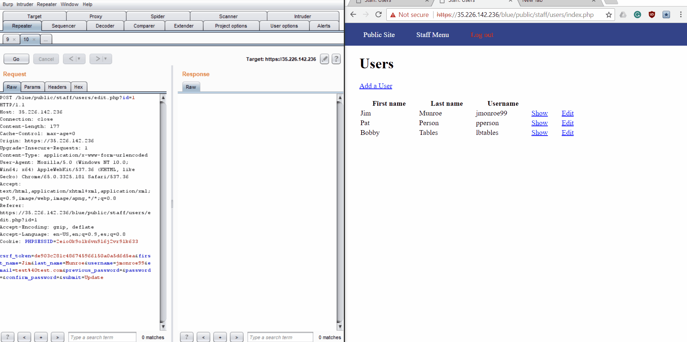

# Project 8 - Pentesting Live Targets

Time spent: **5** hours spent in total

> Objective: Identify vulnerabilities in three different versions of the Globitek website: blue, green, and red.

The six possible exploits are:
* Username Enumeration
* Insecure Direct Object Reference (IDOR)
* SQL Injection (SQLi)
* Cross-Site Scripting (XSS)
* Cross-Site Request Forgery (CSRF)
* Session Hijacking/Fixation

Each version of the site has been given two of the six vulnerabilities. (In other words, all six of the exploits should be assignable to one of the sites.)

## Blue

Vulnerability #1: _Session hijacking using php script_

Vulnerability #2: _SQL injection_

## Green

Vulnerability #1: _Username Enumeration in login screen_

The problem was that, in the case where the username existed in the server, the developer called the span class "failed" instead of "failure" which would have made it bold.

Vulnerability #2: _XSS vulnerability in feedback form_

## Red

Vulnerability #1: _Insecure Object Reference on associates page_

Vulnerability #2: _Cross site request forgery on editing the users information_

I wasn't sure if this was the right thing so I recorded a counter-example on the blue site where this doesn't work using any arbitrary URL.

## Notes

Describe any challenges encountered while doing the work:
Often the hardest part of cracking things is having to repeat trials over and over and I can confirm that this was the case for this assignment as well. One of the other challenges that I found was remembering how all of these different exploits worked because it had been so long since we had used some of them. Another challenge was just getting the websites to work because half of the time that I would load a new page it would crash the site and I would have to go back and forth in my browser history to load it up correctly again.
